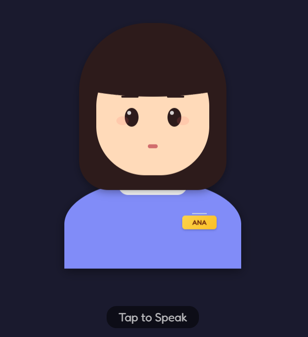
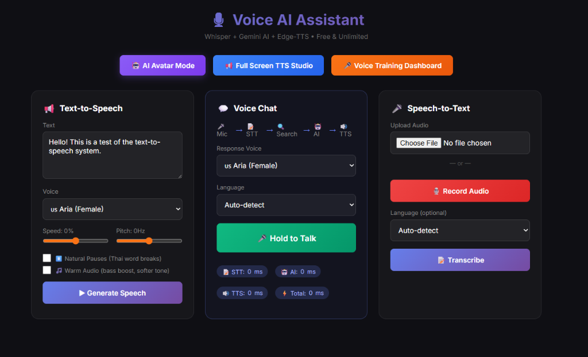

# 🎙️ Ana - AI Voice Assistant

A full-featured AI voice assistant with Text-to-Speech (TTS), Speech-to-Text (STT), and conversational AI capabilities. Built with Flask, featuring a beautiful animated avatar interface.


## ✨ Features

### 🔊 Text-to-Speech (TTS)
- **Edge-TTS** - Free, unlimited, high-quality Microsoft voices (40+ languages)
- **Google TTS** - gTTS integration for additional voice options
- **Google Cloud Neural2** - Premium neural voices with natural intonation
- **Fish Audio** - Custom voice cloning for personalized TTS

### 🎤 Speech-to-Text (STT)
- **Vosk** - Lightweight offline recognition (optimized for Raspberry Pi)
- **OpenAI Whisper** - High-accuracy multilingual transcription

### 🤖 AI Conversation
- **Google Gemini 2.0** - Conversational AI with natural responses
- **Tavily Search** - Real-time web search for current information
- **Short-term Memory** - Context-aware conversations

### 🖥️ Interfaces
- **Animated Avatar** - CSS-based avatar with expressions (happy, sad, angry, surprised)
- **Voice Dashboard** - Voice sample management and cloning
- **TTS Tester** - Test different voices and settings

---

## � Screenshots

### AI Avatar Interface


### Voice Assistant Dashboard


---

## �🚀 Quick Start

### Prerequisites
- Python 3.8+
- FFmpeg (required for audio processing)

### Installation

```bash
# Clone the repository
git clone <your-repo-url>
cd TTS

# Install dependencies
pip install -r requirements.txt

# (Optional) For Raspberry Pi - use lightweight requirements
pip install -r requirements_pi.txt
```

### Configuration

Create environment variables or update `server.py` with your API keys:

```bash
# Required API Keys
GEMINI_API_KEY=your_gemini_api_key
TAVILY_API_KEY=your_tavily_api_key

# Optional (for voice cloning)
FISH_AUDIO_API_KEY=your_fish_audio_api_key

# Optional (for premium Google voices)
GOOGLE_CLOUD_API_KEY=your_google_cloud_api_key
```

> ⚠️ **Security Note**: Never commit API keys to version control. Use environment variables or a `.env` file.

### Run the Server

```bash
python server.py
```

Open your browser to **http://localhost:8080**

---

## 📂 Project Structure

```
TTS/
├── server.py              # Main Flask server (TTS, STT, AI endpoints)
├── index.html             # TTS + STT tester interface
├── avatar.html            # Animated avatar interface
├── voice_dashboard.html   # Voice cloning management
├── styles.css             # Shared styles
├── requirements.txt       # Python dependencies
├── requirements_pi.txt    # Raspberry Pi optimized dependencies
├── setup_pi.sh            # Raspberry Pi setup script
├── outputs/               # Generated audio files (auto-cleared)
├── voice_samples/         # Uploaded voice samples for cloning
└── vosk-model-small-en-us-0.15/  # Offline STT model (optional)
```

---

## 🔌 API Endpoints

| Endpoint | Method | Description |
|----------|--------|-------------|
| `/` | GET | Main TTS tester interface |
| `/avatar` | GET | Animated avatar interface |
| `/dashboard` | GET | Voice cloning dashboard |
| `/api/tts` | POST | Text-to-Speech conversion |
| `/api/stt` | POST | Speech-to-Text transcription |
| `/api/chat` | POST | AI chat with Gemini |
| `/api/voice/chat` | POST | Full pipeline: STT → AI → TTS |
| `/api/voice/upload` | POST | Upload voice sample |
| `/api/voice/clone` | POST | Create voice clone |
| `/api/voice/list` | GET | List cloned voices |

### Example: TTS Request

```bash
curl -X POST http://localhost:8080/api/tts \
  -H "Content-Type: application/json" \
  -d '{"text": "Hello, world!", "voice": "en-US-AriaNeural"}'
```

---

## 🍓 Raspberry Pi Deployment

See [README_PI.md](README_PI.md) for detailed Raspberry Pi setup instructions.

**Quick steps:**
1. Transfer files to your Pi
2. Run `sh setup_pi.sh`
3. Start with `python3 server.py`
4. Open **http://localhost:8080/avatar** in Chromium

---

## 🎨 Available Voices

### Edge-TTS (Free & Unlimited)
| Voice | Language | Gender |
|-------|----------|--------|
| en-US-AriaNeural | English (US) | Female |
| en-US-GuyNeural | English (US) | Male |
| en-GB-SoniaNeural | English (UK) | Female |
| th-TH-PremwadeeNeural | Thai | Female |
| ja-JP-NanamiNeural | Japanese | Female |
| ko-KR-SunHiNeural | Korean | Female |

### Google Cloud Neural2 (Premium)
| Voice | Language | Quality |
|-------|----------|---------|
| th-TH-Neural2-C | Thai | Neural |
| en-US-Neural2-A | English (US) | Neural |

---

## 🔒 Security Notes

This project contains sections that require API keys. Ensure you:

1. **Never commit API keys** to version control
2. Use **environment variables** for sensitive data
3. The avatar interface includes a **PIN lock** for settings access
4. Voice samples are stored locally in `voice_samples/`

---

## 🛠️ Development

### Adding New TTS Providers

1. Create a function in `server.py` following the pattern:
```python
def my_provider_tts(text: str, voice: str, start_time: float):
    # Generate audio and return JSON response
    pass
```

2. Register in the `/api/tts` endpoint

### Supported Audio Formats
- Output: MP3 (128kbps default)
- Input: WAV, MP3, M4A, WebM

---

## 📜 License

MIT License - See LICENSE file for details.

---

## 🙏 Acknowledgments

- [Edge-TTS](https://github.com/rany2/edge-tts) - Microsoft Edge TTS
- [OpenAI Whisper](https://github.com/openai/whisper) - Speech recognition
- [Vosk](https://alphacephei.com/vosk/) - Offline STT
- [Fish Audio](https://fish.audio) - Voice cloning
- [Google Gemini](https://ai.google.dev/) - Conversational AI
- [Tavily](https://tavily.com/) - AI search API
